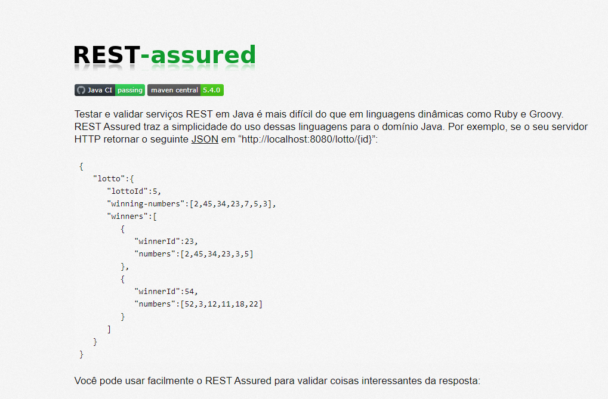

# Teste de API com Rest Assured

Este repositório contém testes automatizados para a API de um sistema financeiro, utilizando a biblioteca Rest Assured para validação de requisições e respostas HTTP.



## Índice

- [Introdução](#introdução)
- [Configuração](#configuração)
- [Estrutura do Projeto](#estrutura-do-projeto)
- [Testes Implementados](#testes-implementados)
  - [Testes de Contas](#testes-de-contas)
  - [Testes de Movimentações](#testes-de-movimentações)
  - [Testes de Saldo](#testes-de-saldo)
  - [Testes de Autenticação](#testes-de-autenticação)
- [Executando os Testes](#executando-os-testes)
- [Conclusão](#conclusão)

## Introdução

Este projeto demonstra como testar APIs RESTful usando Rest Assured em Java. Os testes focam em validar diferentes endpoints fornecidos por um sistema financeiro, garantindo a funcionalidade correta e as respostas esperadas.

## Configuração

Para executar estes testes, você precisa do seguinte:

- Java Development Kit (JDK) 8 ou superior
- Maven

Clone o repositório e navegue até o diretório do projeto:

```bash
git clone https://github.com/carolineoliveiraa/curso-rest-assured.git
cd curso-rest-assured
```

## Testes Implementados

### Testes de Contas

#### Incluir Conta com Sucesso

- **Descrição**: Teste para adicionar uma nova conta.
- **Endpoint**: `POST /contas`
- **Validações**:
  - Código de status 201

#### Alterar Conta com Sucesso

- **Descrição**: Teste para alterar uma conta existente.
- **Endpoint**: `PUT /contas/{id}`
- **Validações**:
  - Código de status 200
  - Nome da conta alterado corretamente

#### Inserir Conta com Mesmo Nome

- **Descrição**: Teste para validar a criação de conta com nome duplicado.
- **Endpoint**: `POST /contas`
- **Validações**:
  - Código de status 400
  - Mensagem de erro apropriada

### Testes de Movimentações

#### Inserir Movimentação com Sucesso

- **Descrição**: Teste para adicionar uma nova movimentação.
- **Endpoint**: `POST /transacoes`
- **Validações**:
  - Código de status 201

#### Validar Campos Obrigatórios de Movimentação

- **Descrição**: Teste para validar os campos obrigatórios ao adicionar uma movimentação.
- **Endpoint**: `POST /transacoes`
- **Validações**:
  - Código de status 400
  - Mensagens de erro apropriadas para cada campo obrigatório

#### Inserir Movimentação com Data Futura

- **Descrição**: Teste para validar a criação de movimentação com data futura.
- **Endpoint**: `POST /transacoes`
- **Validações**:
  - Código de status 400
  - Mensagem de erro apropriada

#### Remover Conta com Movimentação

- **Descrição**: Teste para validar a remoção de conta que possui movimentações.
- **Endpoint**: `DELETE /contas/{id}`
- **Validações**:
  - Código de status 500
  - Mensagem de erro apropriada

#### Remover Movimentação

- **Descrição**: Teste para remover uma movimentação existente.
- **Endpoint**: `DELETE /transacoes/{id}`
- **Validações**:
  - Código de status 204

### Testes de Saldo

#### Calcular Saldo das Contas

- **Descrição**: Teste para calcular o saldo de uma conta.
- **Endpoint**: `GET /saldo`
- **Validações**:
  - Código de status 200
  - Saldo calculado corretamente para a conta

### Testes de Autenticação

#### Acessar API sem Token

- **Descrição**: Teste para validar o acesso à API sem token de autenticação.
- **Endpoint**: `GET /contas`
- **Validações**:
  - Código de status 401

## Executando os Testes

Para executar os testes, utilize o seguinte comando Maven:

```bash
mvn test
```

# Conclusão

Este projeto fornece exemplos de como testar APIs RESTful usando Rest Assured em Java. Os testes cobrem diversas funcionalidades de um sistema financeiro, garantindo a correta implementação e comportamento dos endpoints. Com este conjunto de testes, é possível assegurar a integridade e a confiabilidade da API.

Para mais informações, consulte a [documentação do Rest Assured](https://rest-assured.io/).
